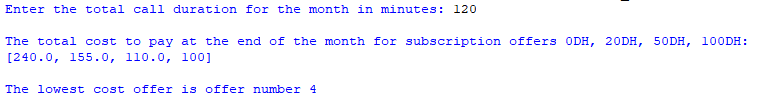
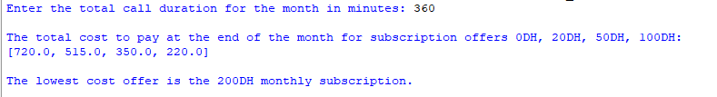

## Description:
This program is designed to assist users in identifying the lowest-cost monthly subscription plan for their phone calls. By providing the total call duration for a month, the program calculates and compares the costs associated with different subscription offers. These offers include 0DH, 20DH, 50DH, and 100DH plans, each with specific pricing structures, including free minutes and additional charges. The program's primary goal is to determine the subscription plan with the lowest total cost for the user based on their call usage. If all subscription costs exceed 200DH, it also identifies the option of a 200DH plan.
## Example
♡ Example 1  
  
♡ Example 2  

